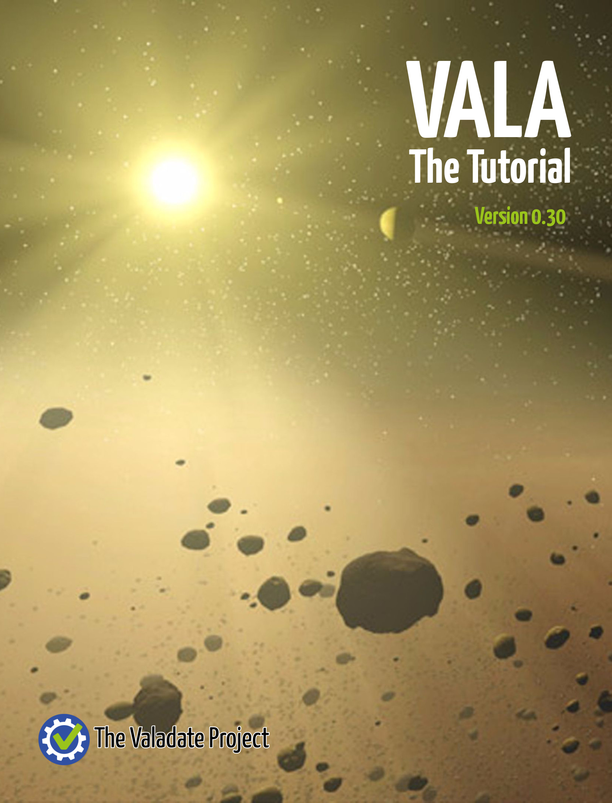

# The Vala Tutorial

##### The Vala Tutorial is an initiative of the [Valadate Project](http://www.valadate.org).

The Vala Tutorial is covered by the [LGPL 2.1](COPYING.md).

Cover Image: By NASA/JPL-Caltech/T. Pyle (SSC), Public Domain, http://www.spitzer.caltech.edu/images/2405-sig05-027-Belt-of-Dust
